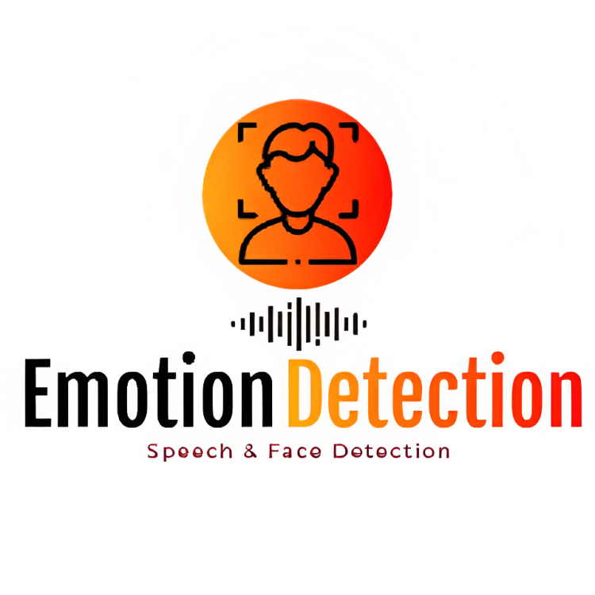

  

  
# Project Title:
### Emotion Detection
  

## Dataset file:
Audio dataset https://www.kaggle.com/datasets/uwrfkaggler/ravdess-emotional-speech-audio

## Team Members:

- Fahad Alotaibi: [LinkedIn](https://www.linkedin.com/in/fahad-alotaibi-917aba127/)
  - Data Collection and Data Preprocessing and Data Modling 
- Sultan Alhurbi: [LinkedIn](https://www.linkedin.com/in/sultan-alharbi-a6a166201)
  - Data Collection and Data Preprocessing and Data Modling  
- Salman Almalki: [LinkedIn](https://www.linkedin.com/in/salman-almalki)
  -  Data Modeling and Model Tuning and Model Deployment 
- Fahad Alluqmani: [LinkedIn](https://www.linkedin.com/in/fahad-alloqmani)
  -  Data Modeling and Model Tuning and Model Deployment 
    
## Introduction:
- In this project, we aim to develop a deep learning-based system for emotion recognition from speech and facial expressions. The project consists of two parts: speech     
  emotion recognition and face emotion recognition. For speech emotion recognition, we use the RAVDESS dataset from Kaggle and train a Convolutional LSTM (CLSTM) model to 
  detect emotions in voices. For face emotion recognition, we use the Mediapipe library to extract facial landmarks in real-time from a live camera feed, and use a pre- 
  trained neural network to predict the emotion.  

  
## Dataset Overview
- The RAVDESS dataset consists of speech audio files produced as part of research on speech emotion recognition. The dataset includes 24 actors (12 male, 12 female), and 
  each actor recorded eight emotions (neutral, calm, happy, sad, angry, fearful, disgust, and surprised) in two intensities (normal and strong). The total number of audio 
  files in the dataset is 1,440.
- Dataset generated in real-time by capturing video from the webcam using OpenCV and processing it using the MediaPipe library. The data is generated by extracting landmark    features of the face and hands from the video frames and storing them in a list.

## Proposed Algorithms

### Speech Emotion Recognition

- We train a Convolutional LSTM (CLSTM) model to detect emotions in voices from the RAVDESS dataset. The CLSTM model consists of multiple LSTM layers followed by dense 
  layers.
- The first 3 layers are 1D convolutional and max-pooling layers with varying numbers of filters and ReLU activation function. A batch normalization layer is added after 
  each max-pooling layer to normalize the output. Dropout layers with a rate of 0.3 are added after each convolutional layer to prevent overfitting.

- The next three layers are LSTM layers with 128 units, where the first two have return sequences set to True. These layers are used to learn temporal dependencies in the      input data.

- The seventh layer is a dropout layer with a dropout rate of 0.3.

- The eighth to tenth layers are dense layers with ReLU activation function and 128, 64, and 32 units, respectively.

  

### Face Emotion Recognition

- For face emotion recognition, we use the Mediapipe library to extract facial landmarks in real-time from a live camera feed. We use a pre-trained neural network to predict   the emotion from the extracted features. The neural network is trained on the FER-2013 dataset, which consists of facial expressions labeled as one of seven categories     
  (angry, disgust, fear, happy, sad, surprise, neutral).

  
  

## Final Results and Conclusion

We train and evaluate the CLSTM model for speech emotion recognition and the pre-trained neural network for face emotion recognition. We achieve an accuracy of 90% on the test set for speech emotion recognition and an accuracy of 93% on the test set for face emotion recognition. 

Overall, our project demonstrates the effectiveness of deep learning-based approaches for emotion recognition from speech and facial expressions. Our models can be deployed in real-world applications, such as sentiment analysis in customer service and emotion-based recommendation systems.

